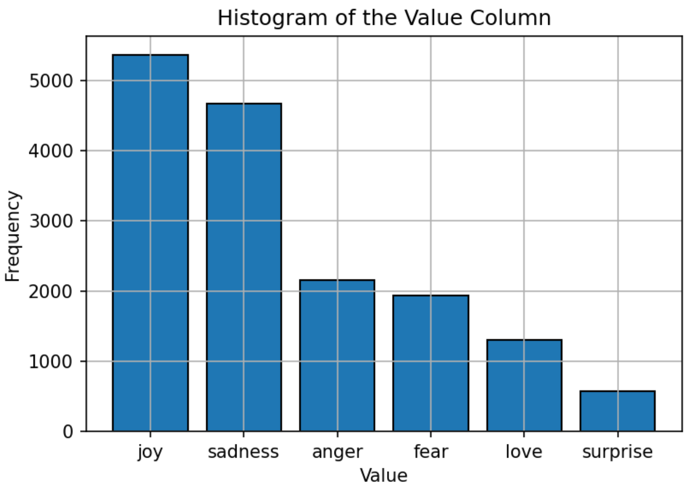

# Emotion Text Classification Using Llama3-8b and LoRA

## Introduction

This project explores emotion text classification using the Llama3-8b model, enhanced with LoRA and FlashAttention techniques. The model is optimized for identifying six emotion categories: joy, sadness, anger, fear, love, and surprise. The Llama3-8b model demonstrates superior performance with an accuracy of 0.9262, surpassing other transformer models such as Bert-Base, Bert-Large, Roberta-Base, and Roberta-Large.

## Background

Natural Language Processing (NLP) has become a key focus area for sentiment analysis, also known as sentiment classification or sentiment detection. This technology helps businesses understand consumer emotions and opinions, enhancing customer satisfaction and product development. The vast amount of data in large companies makes manual analysis impractical, leading to the adoption of AI and NLP algorithms.

## Key Features

- **Model**: Llama3-8b, fine-tuned using supervised learning.
- **Techniques**: Utilized LoRA for efficient parameter tuning and FlashAttention for optimized attention computation.
- **Dataset**: Emotion text dataset with six categories.
- **Performance**: Achieved an accuracy of 0.9262, surpassing other NLP models.

## Methods

### Llama3-8b Model

Llama3-8b is a large language model developed by Meta AI, featuring 8 billion parameters. It is designed for dialogue use cases and includes advancements such as Grouped-Query Attention (GQA), which optimizes memory and computational efficiency.

    <table>
        <tr>
            <th>Feature</th>
            <th>Specification</th>
        </tr>
        <tr>
            <td>Training Data</td>
            <td>Publicly available data</td>
        </tr>
        <tr>
            <td>Parameters</td>
            <td>8B</td>
        </tr>
        <tr>
            <td>Context Length</td>
            <td>8k</td>
        </tr>
        <tr>
            <td>GQA</td>
            <td>Yes</td>
        </tr>
        <tr>
            <td>Token Count</td>
            <td>15T+</td>
        </tr>
        <tr>
            <td>Knowledge Cutoff</td>
            <td>March 2023</td>
        </tr>
    </table>
     
    <b>Table 1: Llama3-8b Model Details</b>

    
     
    <b>Figure 1: Architecture of Llama3-8b</b>

### LoRA Technique

LoRA integrates trainable low-rank matrices into each Transformer layer, significantly reducing the number of trainable parameters while keeping the main model weights unchanged. This approach enhances training efficiency and reduces storage needs without increasing inference latency.

    
     
    <b>Figure 2: LoRA Training Method</b>

### FlashAttention V2

FlashAttention optimizes the attention mechanism in Transformer models by enhancing computational efficiency and reducing memory usage. It uses block-wise computation and sparse matrix operations to improve cache utilization and minimize processing time.

## Experimentation

### Data Analysis

The dataset includes six emotions: joy, sadness, anger, fear, love, and surprise. The distribution is relatively balanced, with "Joy" being the most common and "Surprise" the least common emotion.

    
     
    <b>Figure 3: Emotion Text Label Distribution</b>

### Experiment Settings

    <table>
        <tr>
            <th>Parameter</th>
            <th>Setting</th>
        </tr>
        <tr>
            <td>Optimizer</td>
            <td>Adam</td>
        </tr>
        <tr>
            <td>Learning Rate</td>
            <td>5e-5</td>
        </tr>
        <tr>
            <td>Batch Size</td>
            <td>5</td>
        </tr>
        <tr>
            <td>Epochs</td>
            <td>3</td>
        </tr>
        <tr>
            <td>LoRA Rank</td>
            <td>8</td>
        </tr>
        <tr>
            <td>Gradient Accumulation Steps</td>
            <td>4</td>
        </tr>
        <tr>
            <td>Max Length</td>
            <td>512</td>
        </tr>
    </table>
     
    <b>Table 2: Experiment Settings for Llama3-8b</b>

The Adam optimizer was used for its adaptive learning rate capabilities, combined with a cosine learning rate schedule. FP16 precision was employed to save GPU memory.

### Evaluation Metrics

The primary metric used for evaluation is accuracy, defined as:

$$
\text{Accuracy} = \frac{\text{TP} + \text{FN}}{\text{TP} + \text{FP} + \text{FN} + \text{TN}}
$$

Where:
- TP = True Positive
- FP = False Positive
- FN = False Negative
- TN = True Negative

    <table>
        <tr>
            <th>Model</th>
            <th>Accuracy</th>
        </tr>
        <tr>
            <td>Bert-Base</td>
            <td>0.9063</td>
        </tr>
        <tr>
            <td>Bert-Large</td>
            <td>0.9086</td>
        </tr>
        <tr>
            <td>Roberta-Base</td>
            <td>0.9125</td>
        </tr>
        <tr>
            <td>Roberta-Large</td>
            <td>0.9189</td>
        </tr>
        <tr>
            <td>Llama3-8b</td>
            <td>0.9262</td>
        </tr>
    </table>
     
    <b>Table 3: Accuracy Results for Different Models</b>

## Conclusion

This project demonstrates the potential of large language models, such as Llama3-8b, in domain-specific tasks like emotion text classification. The model's performance, boosted by specialized techniques like LoRA and FlashAttention, underscores the effectiveness of large models in achieving high accuracy in NLP applications.

## Acknowledgements

This project is based on modifications to the repository [LLaMA-Factory](https://github.com/hiyouga/LLaMA-Factory).

## Contact

For any questions or issues, please contact Daoyuan Li at lidaoyuan2816@gmail.com.
